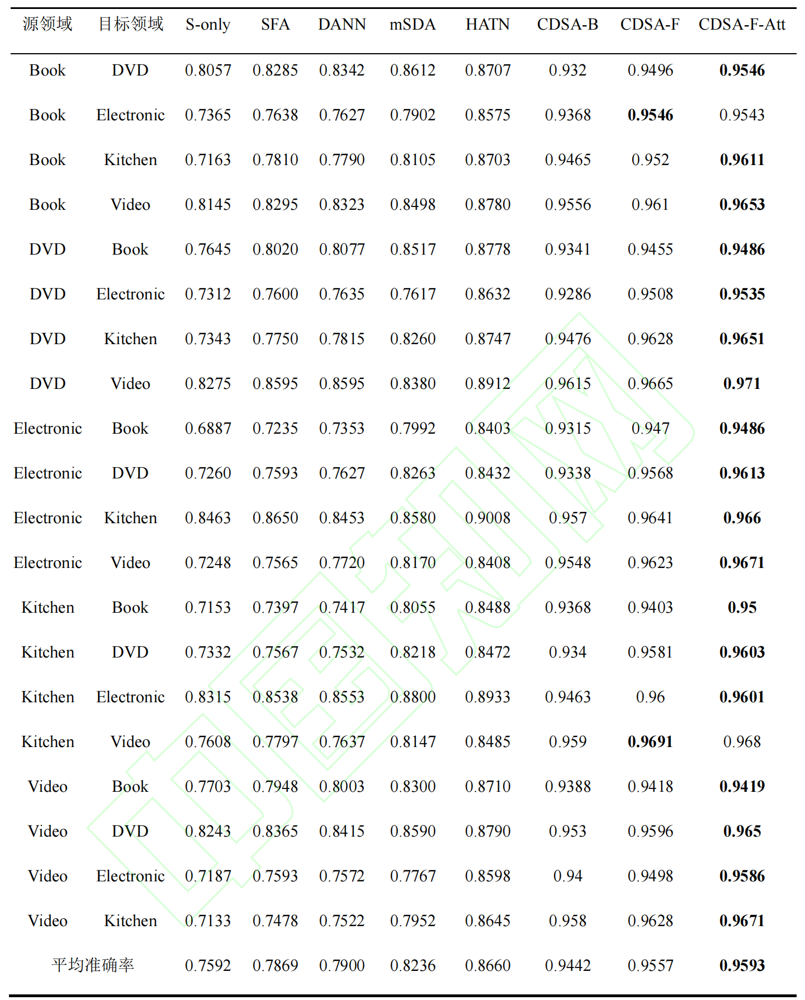
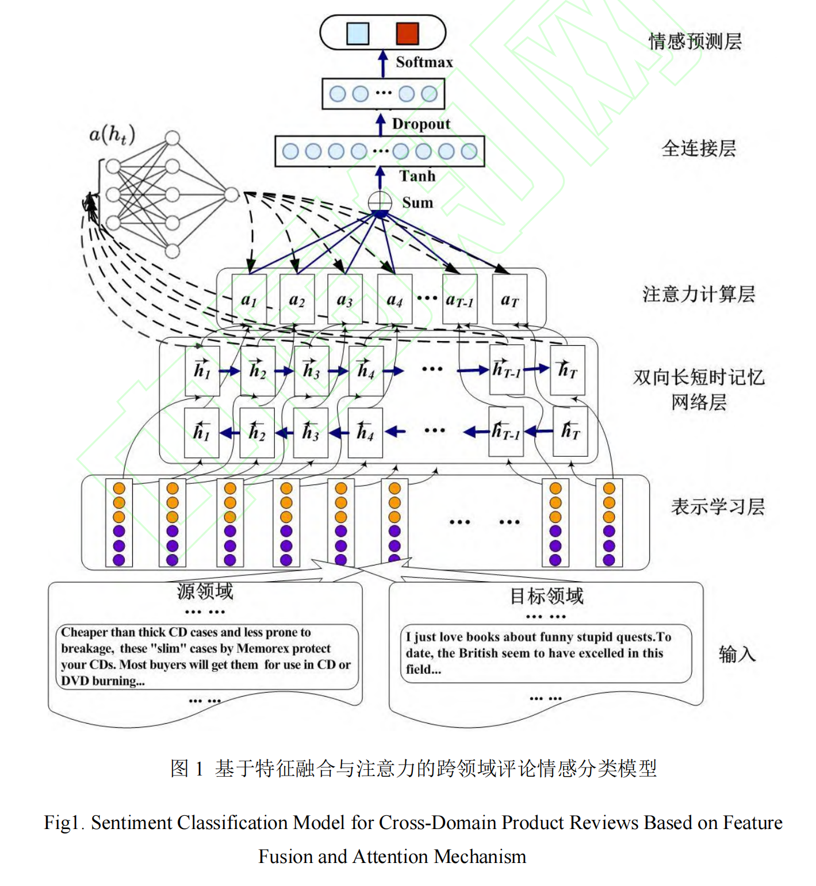

# CDSA-F-Att
Codes for our paper: "Sentiment Analysis of Cross-Domain Product Reviews Based on Feature Fusion and Attention Mechanism"

> CDSA-F-Att,  a Cross-Domain Sentiment Analysis model based on Feature Fusion and Attention Mechanism

## Requirement
* Python >= 3.7
* Keras >= 2.3.0
* [bert-as-service](https://github.com/hanxiao/bert-as-service) = 1.9.7

## BERT Language Model
### 1. Download the Pre-trained BERT Model
* [uncased_L-12_H-768_A-12](https://github.com/google-research/bert)
### 2. Start the BERT service

    bert-serving-start -model_dir /BERT/uncased_L-12_H-768_A-12

## Usage
### Training
    python train_cdsa_*.py
### Testing
    python test_*.py
### Tips
* For non-Att-based models, use `test_base.py`
* utils/word2vec.py: Generating cross-domain word vectors

## Model Performance

We made our efforts to make our benchmarks reproducible. However, the performance of the CDSA-F-Att models fluctuates and any slight changes in the model structure could also influence performance. Try different random seed to achieve optimal results.

### Performance on Amazon Datasets

## Model Architecture

## Citing
If you use CDSA-F-Att in a scientific publication, we would appreciate references to the following BibTex entry:
    
    @article{
       title = {融合特征与注意力的跨领域产品评论情感分析},
       author = {祁瑞华, 简悦, 郭旭, 关菁华, 杨明昕},
       journal = {数据分析与知识发现},
       url = {http://manu44.magtech.com.cn/Jwk_infotech_wk3/CN/abstract/article_4891.shtml},
       doi = {10.11925/infotech..2020.0535}
       year = {2020}
    }

## Licence
MIT License